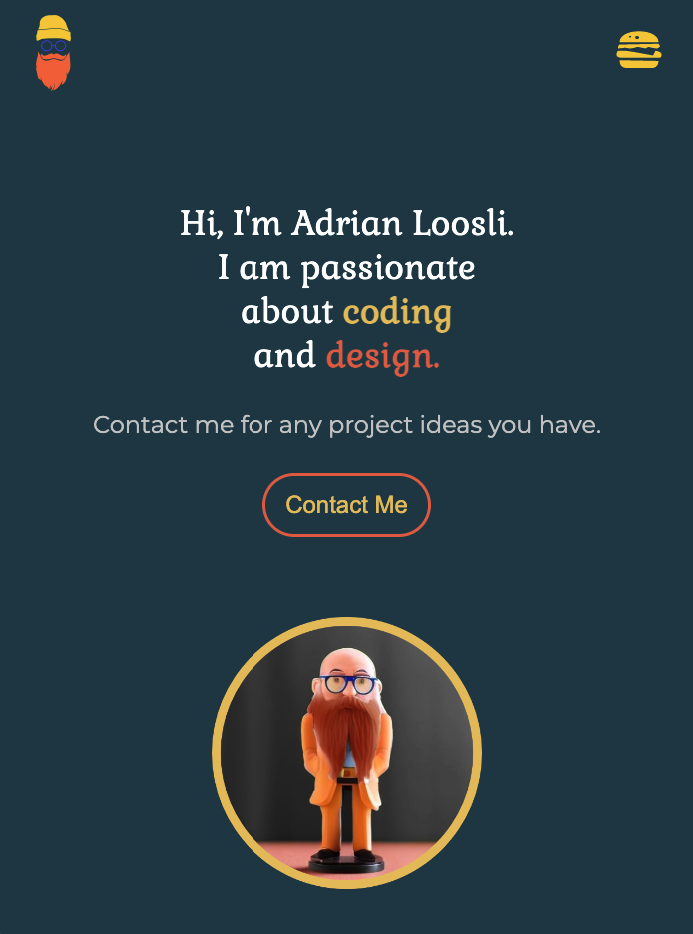

# React Portfolio
This my portfolio built with React. It is a single page application that uses React Router to navigate, without the need for the page to refresh.

## Table of Contents
* [Features](#features)
* [Live Demo](#live-demo)
* [Screenshots](#screenshots)
* [Technologies](#technologies)
* [Libraries](#libraries)
* [Credits](#credits)

## Features
* About Me: A welcome page with a short introduction and a profile picture.
* Skills: A page with icons representing my programming skills.
* My Work: A page showcasing my projects with images, descriptions, and links.
* Contact Me: A page with a contact form to get in touch.  

The website is responsive and mobile-friendly, and includes a hamburger menu for smaller screens.

## Live Demo
[Live Demo](https://adrian-loosli.netlify.app/)

## Screenshot

## Technologies
* React
* React Router
* HTML
* CSS
* JavaScript

## Libraries
* [Framer Motion](https://www.framer.com/motion/)

## Credits
I received a lot of help, especially for the animations, from DevelopedByEd's creative React course. https://developedbyed.com/courses

